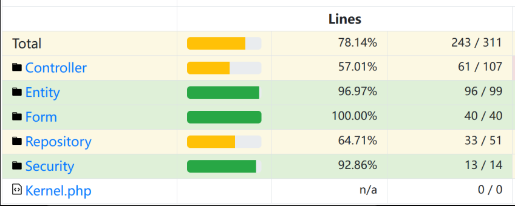

# SE & Webtech Project

## Project URL's
Provide a link to the main page of your application. Or if you have multiple parts in your website you can provide a list of links (i.e. not all pages are in your main navigation bar)
* [Main login page](https://a22web25.studev.groept.be/)
* [Admin page](https://a22web25.studev.groept.be/admin)
---

## Website credentials
### Regular user
- login: user
- password: password
### Admin
- login: admin
- password: password

---

## Implemented Features
Provide a short description of the actual implemented features in your project
* User Authentication and Registration
* Advanced book search and filtering
* Book favorites
* Admin page for library employees
 ---

## Test Coverage
